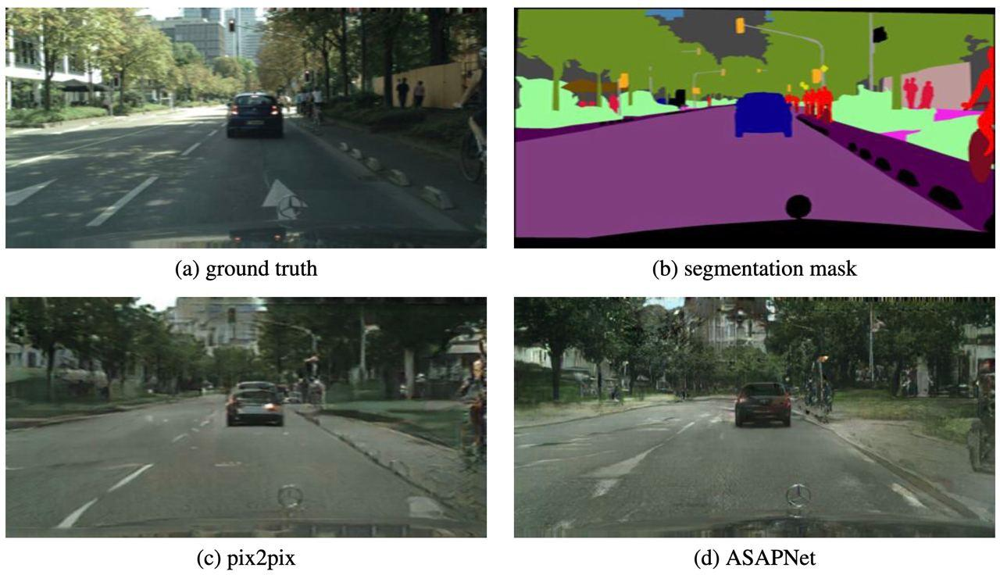

# FastIm2Im

This is a GitHub repository for FastIm2Im project at Skoltech ML course (2022).

Link to the slides: [Link](https://docs.google.com/presentation/d/1VhlPPGtyMzGzHkACw0M9pxrOm7wo8_vGzC9RwNy0ygk/edit?usp=sharing)

Link to the video presentation: [Link](https://drive.google.com/file/d/19nTsP4ITxt1BhgzDF6pcmNkntT8aNcO-/view?usp=sharing)

## Abstract

The main goal of this project is to replicate the experiments and compare the performance of a novel pixel-wise network called ASAPNet with its fully-convolutional counterparts. In particular, we compare its performance with pix2pix in paired image-to-image Translation task and with DnCNN for denoising task. As a result, we show that ASAPNet is indeed better in Paired Image-to-Image Translation task, being comparable to pix2pix in terms of inference time. ASAPNet shows poor performance in denoising task but being much faster compared to DnCNN.

### Inference example (Img2Img)

## Project Structure

- `ASAPNet`: code for ASAPNet model — image2image translation case 
- `Pix2Pix`: code for Pix2Pix model — image2image translation case 
- `denoising`: code for research part of the project — DnCNN and ASAPNet denoising models

All the details on project components are in the folders' own READMEs
